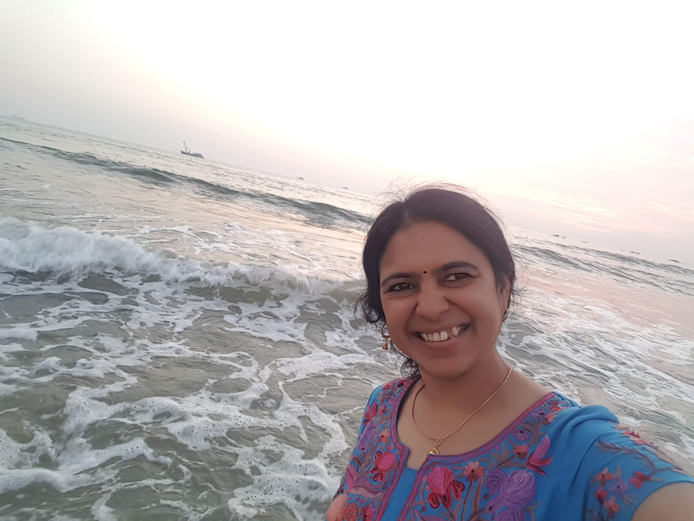

 

### Hello
Visit me on [Uma Arakalagudu](https://www.linkedin.com/in/uma-arakalagudu-10652677/) 

## Me
I am a Project Management Consultant currently working for Aritha Consulting.

## My Skills
- Project Management including tracking,reporting, quality, people, issue, scope,schedule, risk, financials etc
- Presales
- Requirement gathering and analysis
- Training the end users
- Change Impact Analysis

## My Education
PES College of Engineering, Mandya— BE (CS&E) – Jul 1999

## My Credentials
SAP Certified HR Consultant

## Career Background
At Aritha Consulting, I manage web based and mobile based projects from requirements cycle, development and delivery. 

Before this, I was working with Infosys Ltd as a Senior Project Manager in my last role with the company. 
I started as a software developer for Oracle Apps ERP solution, moved on to specialise in Oracle HR as a funcational consultant, 
and then got certified as SAP HR functional consultant.

I moved on to manage SAP HR projects including Implementation, Maintenance and Roll-Outs.

